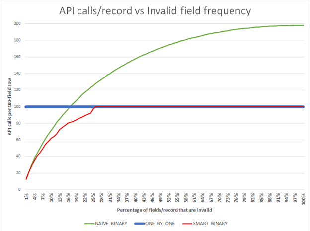

# Record Processing Sim

##### A little Python model to assess the API calls needed to process some records
##### ...given the following, particular scenario

- You aim to process many records through an API call
- Each record has 100 fields
- You can call the API with any number of fields for each record (e.g., just one, or all 100)
- The API call fails without any explanation if any of the fields is invalid, and the good fields are not processed
- You are not at the outset sure what % of fields are invalid on the typical record
- For this simulation we are not trying to learn which fields are usually the invalid ones (though that would usually be a good idea IRL)

### Our Goal
##### Model several strategies for updating all valid fields on all records, with the minimum number of API calls

Strategies tested:
| Strategy     | Description |
| ----------- | ----------- |
| One by One      | Run each field, one-by-one (which of course yields 1 API call per field) |
| Naive Binary   | Sends half the records to the API with each call, then drill down recursively on failed API calls, successively splitting the remaining records in half |
| Smart Binary   | First, partition each record into a number of fields such that each API call has approximately a 50/50 chance of succeeding. When a call fails, proceed to use the "Naive binary" model to drill down recursivily on the remaining records (i.e., we split the failed list of fields in half, and run each of them, continuing recursively until all valid fields have been processed)        |

